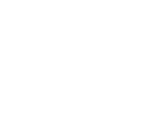

# knotpen2




扭结与链环的绘制、PD_CODE 计算工具

## 操作指南

### 启动软件
- 解压
- 双击 main.exe 运行
- 请注意关闭输入法，否则能会影响软件的正常操作

### 视角移动

- 使用键盘 WASD 移动屏幕位置（屏幕上没有节点时无效果）

### 语言切换

- 双击键盘上的字母 n 可以在英文和中文之间切换语言（已经显示在屏幕上的文字无法切换）

### 节点创建

- 打开软件时，操作模式默认为普通模式
  - 普通模式下，使用**鼠标左键单击**创建节点
  - 使用**鼠标右键单击**可以删除节点和边
  - **双击边的中点**可以对边进行细分，将原来的一条边拆分成两相连条边
  - **鼠标按住拖拽**可以移动已经创建的节点的位置
  - **点击线段交叉点**可以切换相交线段的上下位置关系
    - 反直觉提醒：由于交叉点的换序是线段与线段之间的关系
    - 每当移动节点位置之后，请务必重新检查所有交叉点的前后关系是否符合预期
  - 度不等于 2 的结点会使用实心灰色高亮显示


- 点击节点，使其变成红色，从而进入连续创建模式
  - 连续创建模式下，左键连续点击空白处可以连续创建节点，并自动和上一个创建的节点连边
  - 连续创建模式下，点击**键盘 delete 或者 backspace 键**可以删除当前选中的节点，并回到普通模式
  - 左键点击红色的节点，或者右键点击任意位置可以退出连续创建模式
  - 在连续创建模式下，点击现有的节点，可以将曲线闭合并自动退出连续创建模式
  - 连续模式下，**按 b (base) 键**确定起始点（起始点使用蓝色表示）
  - 连续模式下，**按 t (to) 键**确定方向点，方向点不能与起始点重合（方向点使用绿色表示）

- **连续点击两次 c (clear)键** 清空所有数据
  - 如果你不小心清空了所有数据，可以连**续点击两下 r （recover）**以恢复上一次自动保存的数据


### 计算 PD_CODE

- 本程序采用的 PD_CODE 定义详见：https://katlas.org/wiki/Planar_Diagrams


- 在计算 PD_CODE 前，你需要保证
  - 扭结中没有三线共点（这一点目前版本的程序并不提供检查，请人工保证这一点）
  - 扭结中每个节点的都有且仅有两条出边
  - 每一个连通分支都恰有一个起始点和一个方向点，且起始点和方向点必须相邻
- 如果出现了上述情况，程序会在计算扭结 PD_CODE 时会向用户报错并告知出错原因


- 如果扭结图中没有以上问题，**双击按键 l (launch)** 程序会输出一些图片以及一个文本文件
  - 文本文件中会以四元组的形式输出一个 pd_code
  - 文本文件以及 svg 图片文件会被存储到可执行文件同目录下的 answer 文件夹中
    - 程序会生成三个 SVG 文件
      - 一个是 `.num.svg` 结尾的，带有 PD_CODE 中的弧线编号信息
      - 一个是 `.nonum.svg` 结尾的，不带有 PD_CODE 中的弧线编号信息
      - 一个是 `.arrow.svg` 结尾的，不带有 PD_CODE 中的弧线编号信息，但带有方向信息

## 报错信息

- 如果遇到了应用闪退等问题，可以在本 github 项目上进行 issue
  - 报错时请提供相关错误日志与错误复现流程，日志文件位于可执行文件同目录的 error_log 文件夹

## 开发手册

- 存储结构：[Savings.md](./docs/Savings.md)

## 如何引用

```text
@misc{knotpen2,
  author = {Guo, Guannan},
  title = {Knotpen2: A GUI Based Link PD Notation Calculator},
  year = {2025},
  publisher = {GitHub},
  journal = {GitHub repository},
  howpublished = {https://github.com/GGN-2015/knotpen2},
  note = {Access Date: 你的访问日期}
}
```

